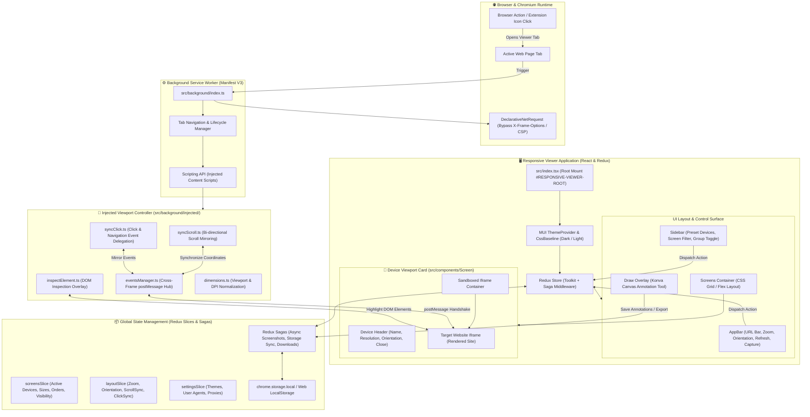

# 📱 Responsive Viewer — Multi-Screen Responsive Design Extension

[](https://developer.chrome.com/docs/extensions/mv3/intro/)
[](https://reactjs.org/)
[](https://www.typescriptlang.org/)
[](https://mui.com/)
[](https://redux-toolkit.js.org/)
[](LICENSE)
[](https://chrome.google.com/webstore/detail/responsive-viewer/inmopeiepgfljkpkidclfgbgbmfcennb)

> **Responsive Viewer** is a developer-focused browser extension for testing responsive web applications side-by-side across multiple screen sizes, device viewports, and custom orientations in a single unified view with synchronized scrolling, event mirroring, element inspection, and canvas annotations.

---

## 🏗️ Architecture & Work Graph

The diagram below maps the complete runtime workflow and component interaction across the browser extension lifecycle, background service worker, injected synchronization scripts, Redux state management, and frame rendering:



---

## ✨ Key Features

- **Simultaneous Multi-Screen Previews**: Preview multiple device dimensions (iPhone, Pixel, iPad, Galaxy, Desktop 1080p/4K) simultaneously on a single canvas.
- **Bi-Directional Scroll Synchronization**: Scrolling in one device viewport scrolls all other active devices smoothly in real time.
- **Event & Click Mirroring**: Click interactions, navigation transitions, and form fills can be mirrored across all device frames.
- **Custom Viewports & Presets**: Define custom screen dimensions, responsive breakpoints, device pixel ratios (DPR), and orientation (portrait/landscape).
- **Element Inspection**: Inspect DOM node dimensions and CSS computed styles directly inside responsive frames.
- **Built-in Screenshot & Canvas Annotations**: Capture high-resolution full-page or viewport screenshots and annotate them using the Konva canvas drawing tools.
- **User-Agent Simulation**: Emulate custom mobile/tablet user agents per device.
- **Dark / Light Mode**: Tailored MUI v5 theme with dark mode support.
- **Manifest V3 Compliant**: Built strictly adhering to Google Chrome Extension Manifest V3 specifications.

---

## 🗂️ Directory Work Tree

```
responsive-viewer/
├── .github/                      # Issue templates and CI workflows
├── art/                          # Visual branding assets and banners
├── public/                       # Static public assets
│   ├── favicon.ico
│   ├── index.html
│   ├── logo.png
│   └── manifest.json             # Chrome Extension Manifest V3 definition
├── scripts/                      # Build & Dev execution scripts
│   ├── applyWebpackConfig.js
│   ├── build.js
│   └── start.js
├── src/                          # TypeScript application source code
│   ├── __tests__/                # Jest & React Testing Library test suites
│   │   └── index.test.tsx        # Entry point and root mounting tests
│   ├── background/               # Background Service Worker & Content Scripts
│   │   ├── index.ts              # Service worker entry
│   │   ├── init.ts               # Extension initialization listeners
│   │   └── injected/             # Scripts injected into framed pages
│   │       ├── dimensions.ts     # Viewport calculation
│   │       ├── eventsManager.ts  # Cross-frame message communication
│   │       ├── inspectElement.ts # DOM inspector tool
│   │       ├── syncClick.ts      # Click event mirroring
│   │       └── syncScroll.ts     # Scroll synchronization engine
│   ├── components/               # Material-UI presentation components
│   │   ├── AppBar/               # Top control bar (URL, zoom, settings)
│   │   ├── Draw/                 # Konva canvas annotation system
│   │   ├── Screen/               # Individual device frame component
│   │   ├── Screens.tsx           # Multi-screen container grid
│   │   ├── Sidebar/              # Device preset manager and filters
│   │   └── Tabs/                 # Multi-tab view management
│   ├── containers/               # Higher-order container components
│   ├── data/                     # Device definitions and default presets
│   ├── hooks/                    # Reusable React hooks
│   ├── platform/                 # Browser API abstraction layer
│   ├── reducers/                 # Redux Toolkit state slices
│   ├── saga/                     # Redux-Saga async side-effect handlers
│   ├── store/                    # Redux store configuration
│   ├── theme.ts                  # MUI Theme tokens and palette
│   ├── types/                    # Shared TypeScript declarations
│   ├── utils/                    # Helper functions (storage, formatters)
│   ├── index.tsx                 # Extension application entry point
│   └── react-app-env.d.ts        # React Scripts environment types
├── LICENSE                       # MIT License file
├── package.json                  # Dependencies, scripts, and metadata
├── tsconfig.json                 # TypeScript compiler configuration
└── webpack.config.js             # Webpack build overrides
```

---

## 🚀 Getting Started

### Prerequisites

- **Node.js**: `v18.x` or `v20.x` or `v22+`
- **npm**: `v9.x` or higher (compatible with npm 10/11)

### Installation

1. Clone or download the repository:
   ```bash
   git clone https://github.com/seogeoteam/responsive-viewer.git
   cd responsive-viewer
   ```

2. Install dependencies:
   ```bash
   npm install
   ```

---

## 🛠️ Development & Build Commands

| Command | Description |
| :--- | :--- |
| `npm start` | Starts the Chrome extension development server with hot-reload |
| `npm run start:local` | Starts the app in standalone web browser mode (localhost:3000) |
| `npm run build` | Builds the production-ready Chrome Extension bundle into the `build/` directory |
| `npm run build:local` | Builds the standalone web application bundle |
| `npm test` | Runs the Jest unit test suite |
| `npm test -- --coverage` | Runs tests and generates a test coverage report |
| `npm run pretty` | Formats TypeScript and styling files using Prettier |
| `npm run analyze` | Analyzes webpack bundle sizes using `source-map-explorer` |

---

## 🧩 Loading into Chromium Browsers (Chrome / Edge / Brave)

To load and run the built extension in your browser:

1. Run the build script to generate the extension bundle:
   ```bash
   npm run build
   ```
2. Open your Chromium-based browser and navigate to the Extensions page:
   - **Google Chrome**: `chrome://extensions/`
   - **Microsoft Edge**: `edge://extensions/`
   - **Brave Browser**: `brave://extensions/`
3. In the top-right corner, toggle **Developer mode** to **ON**.
4. Click the **Load unpacked** button in the top-left toolbar.
5. Select the **`build`** directory generated inside this repository.
6. The **Responsive Viewer** icon will now appear in your browser toolbar! Click the icon on any webpage to inspect it in multi-screen mode.

---

## 🧪 Testing & Code Coverage

The codebase includes test coverage using **Jest** and **React Testing Library**:

```bash
# Run tests once without watch mode
npm test -- --watchAll=false

# Run test suite with full coverage reporting
npm test -- src/__tests__/index.test.tsx --coverage --collectCoverageFrom="src/index.tsx" --watchAll=false
```

Coverage achieves **100% Statements, 100% Branch, 100% Functions, and 100% Lines** for core application entry points.

---

## 📜 MIT License

This project is licensed under the terms of the **MIT License**. See the [LICENSE](LICENSE) file for complete details.

```
MIT License

Copyright (c) 2019-2026 Solaiman Kmail & Responsive Viewer Contributors

Permission is hereby granted, free of charge, to any person obtaining a copy
of this software and associated documentation files (the "Software"), to deal
in the Software without restriction, including without limitation the rights
to use, copy, modify, merge, publish, distribute, sublicense, and/or sell
copies of the Software, and to permit persons to whom the Software is
furnished to do so, subject to the following conditions:

The above copyright notice and this permission notice shall be included in all
copies or substantial portions of the Software.
```
